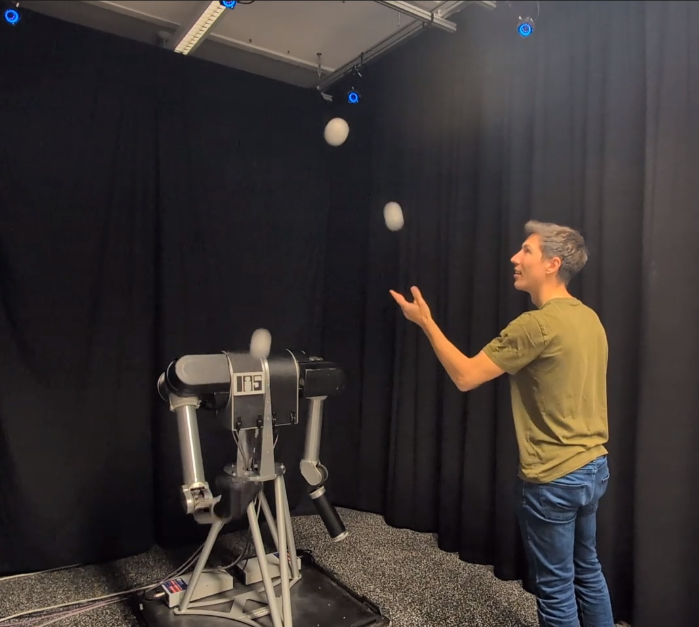

# Human-robot-partner-juggling
This is the repo to the corresponding paper 
"Catch, Throw, Repeat: Planning for Human–Robot Partner Juggling"
The repo contains code and the project page of the Human-Robot Partner Juggling project.

More information will be available once the paper is published. A link to the paper will be added here when it becomes publicly accessible.

**Note:** This project relies on additional repositories that are not yet publicly available. These repositories are planned to be published in the near future, and links to them will be provided here once they are released.
